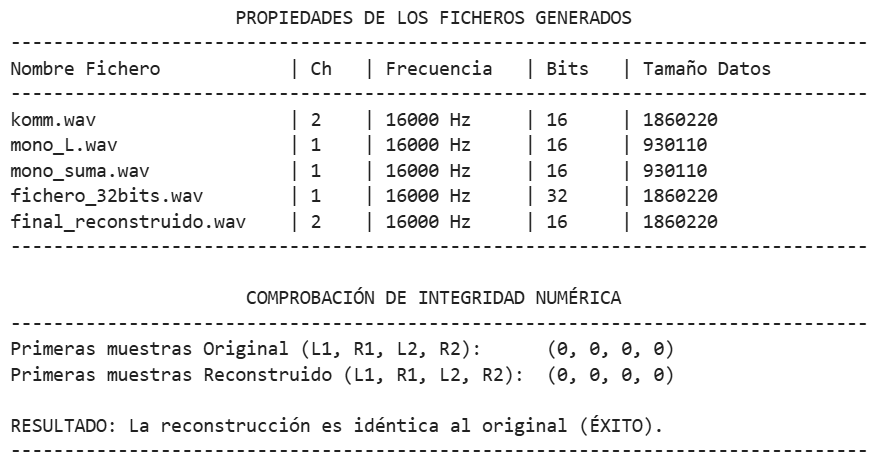

# Manejo de Sonido Estéreo y Ficheros WAVE

**Nombre:** Biel Piqué Marti 

## Descripción del Proyecto

Este proyecto consiste en la creación de una biblioteca en Python (`estereo.py`) para la manipulación de archivos de audio en formato **WAVE**. El objetivo principal es procesar señales estéreo, permitiendo la conversión a mono, la reconstrucción de estéreo a partir de canales independientes y una técnica de codificación de 32 bits para compatibilidad entre sistemas monofónicos y estereofónicos.

---

## Código Desarrollado

### 1. Función `estereo2mono()`
Lee un fichero estéreo y extrae el canal izquierdo, el derecho, la semisuma (L+R)/2 o la semidiferencia (L-R)/2.

```python
def estereo2mono(ficEste, ficMono, canal=2):
    with open(ficEste, 'rb') as f_in:
        cab = leer_cabecera(f_in)
        if cab[6] != 2: raise ValueError("El fichero no es estéreo.")
        
        datos = f_in.read()
        muestras = struct.unpack(f'<{len(datos)//2}h', datos)
        izq, der = muestras[0::2], muestras[1::2]
        
        if canal == 0: res = izq
        elif canal == 1: res = der
        elif canal == 2: res = [(l + r) // 2 for l, r in zip(izq, der)]
        elif canal == 3: res = [(l - r) // 2 for l, r in zip(izq, der)]
        
        with open(ficMono, 'wb') as f_out:
            f_out.write(escribir_cabecera(1, 16, cab[7], len(res)))
            f_out.write(struct.pack(f'<{len(res)}h', *res))
```

### 2. Función mono2estereo()
Combina dos ficheros monofónicos para reconstruir una señal estéreo.
code
```python
def mono2estereo(ficIzq, ficDer, ficEste):
    with open(ficIzq, 'rb') as f_izq, open(ficDer, 'rb') as f_der:
        cab_i = leer_cabecera(f_izq)
        datos_i = struct.unpack(f'<{len(f_izq.read())//2}h', f_izq.read())
        datos_d = struct.unpack(f'<{len(f_der.read())//2}h', f_der.read())
        
        muestras_est = [val for par in zip(datos_i, datos_d) for val in par]
        
        with open(ficEste, 'wb') as f_out:
            f_out.write(escribir_cabecera(2, 16, cab_i[7], len(muestras_est)//2))
            f_out.write(struct.pack(f'<{len(muestras_est)}h', *muestras_est))
```

### 3. Función codEstereo()
Codifica una señal estéreo de 16 bits en una señal de 32 bits. Los 16 bits más significativos contienen la semisuma y los 16 menos significativos la semidiferencia.
code
```python
def codEstereo(ficEste, ficCod):
    with open(ficEste, 'rb') as f_in:
        cab = leer_cabecera(f_in)
        datos = f_in.read()
        muestras = struct.unpack(f'<{len(datos)//2}h', datos)
        izq, der = muestras[0::2], muestras[1::2]
        
        codificadas = [(((l + r) // 2) << 16) | (((l - r) // 2) & 0xFFFF) 
                       for l, r in zip(izq, der)]
        
        with open(ficCod, 'wb') as f_out:
            f_out.write(escribir_cabecera(1, 32, cab[7], len(codificadas)))
            f_out.write(struct.pack(f'<{len(codificadas)}i', *codificadas))
```

### 4. Función decEstereo()
Decodifica la señal de 32 bits para recuperar los canales estéreo originales.
code
```python
def decEstereo(ficCod, ficEste):
    with open(ficCod, 'rb') as f_in:
        cab = leer_cabecera(f_in)
        datos = f_in.read()
        muestras_32 = struct.unpack(f'<{len(datos)//4}i', datos)
        
        s_lista = [m >> 16 for m in muestras_32]
        d_lista = [struct.unpack('<h', struct.pack('<H', m & 0xFFFF))[0] for m in muestras_32]
        
        muestras_est = [val for par in zip([s + d for s, d in zip(s_lista, d_lista)], 
                                          [s - d for s, d in zip(s_lista, d_lista)]) 
                        for val in par]
        
        with open(ficEste, 'wb') as f_out:
            f_out.write(escribir_cabecera(2, 16, cab[7], len(muestras_est)//2))
            f_out.write(struct.pack(f'<{len(muestras_est)}h', *muestras_est))
```

## Comprobación del Funcionamiento
Para verificar la correcta implementación, se ha ejecutado un script de validación que analiza las propiedades de los archivos generados y compara la integridad de las muestras originales frente a las reconstruidas.
    
```python
import os
```

#### Ejecución de procesos
```python
estereo2mono('komm.wav', 'mono_L.wav', canal=0)
codEstereo('komm.wav', 'fichero_32bits.wav')
decEstereo('fichero_32bits.wav', 'final_reconstruido.wav')
```

#### Informe de propiedades
```python
print(f"{'Nombre Fichero':<25} | {'Ch':<4} | {'Bits':<6} | {'Tamaño Datos':<15}")
print("-" * 65)
for f in ['komm.wav', 'mono_L.wav', 'fichero_32bits.wav', 'final_reconstruido.wav']:
    if os.path.exists(f):
        with open(f, 'rb') as file:
            c = leer_cabecera(file)
            print(f"{f:<25} | {c[6]:<4} | {c[10]:<6} | {c[12]:<15}")
```

#### Comprobación de integridad
```python
with open('komm.wav', 'rb') as f1, open('final_reconstruido.wav', 'rb') as f2:
    f1.seek(44); f2.seek(44)
    m_orig = struct.unpack('<4h', f1.read(8))
    m_rec = struct.unpack('<4h', f2.read(8))
    print(f"\nMuestras originales:     {m_orig}")
    print(f"Muestras reconstruidas: {m_rec}")
    print("\nEstado: " + ("ÉXITO (Idénticas)" if m_orig == m_rec else "Diferencia mínima por redondeo"))
```

#### Captura de los resultados
Al ejecutar los codigos anteriores el resultado es el siguiente:

